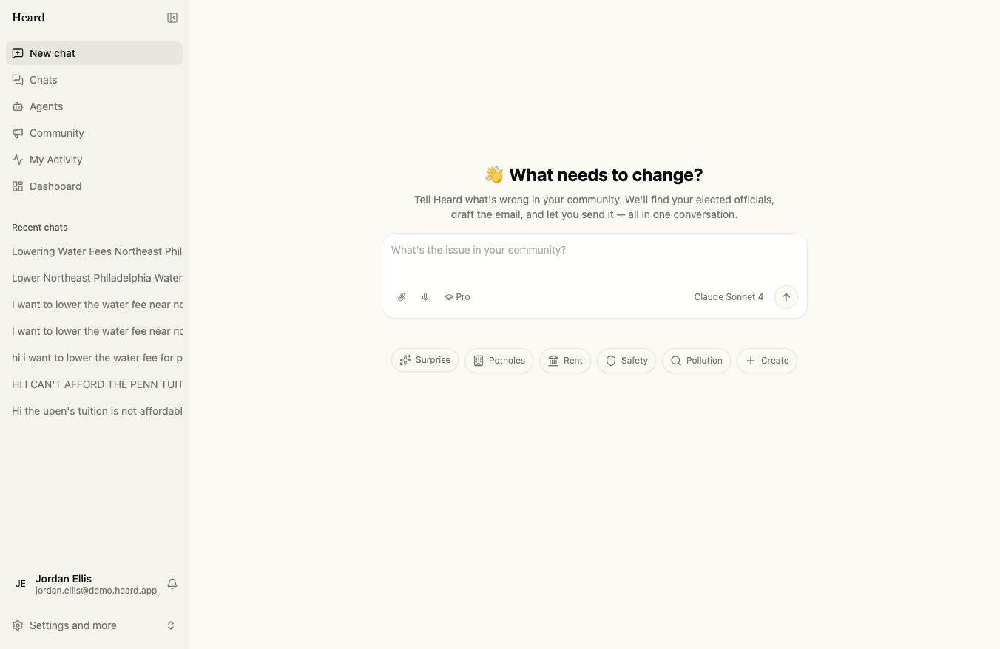
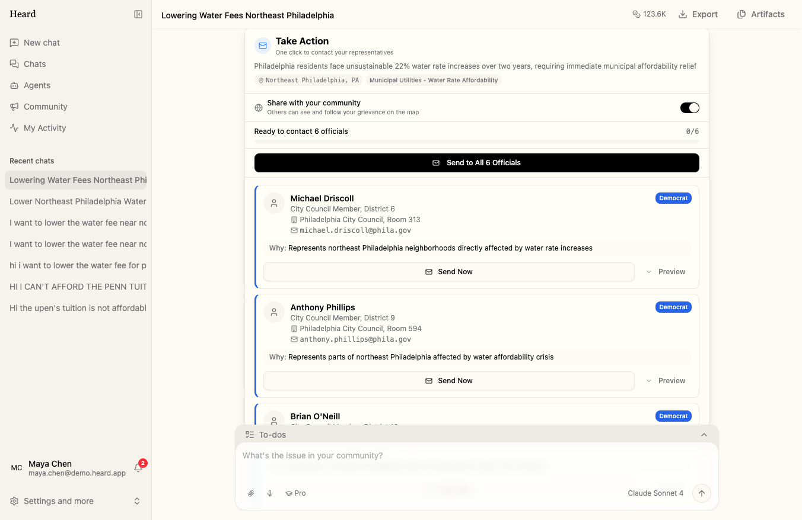
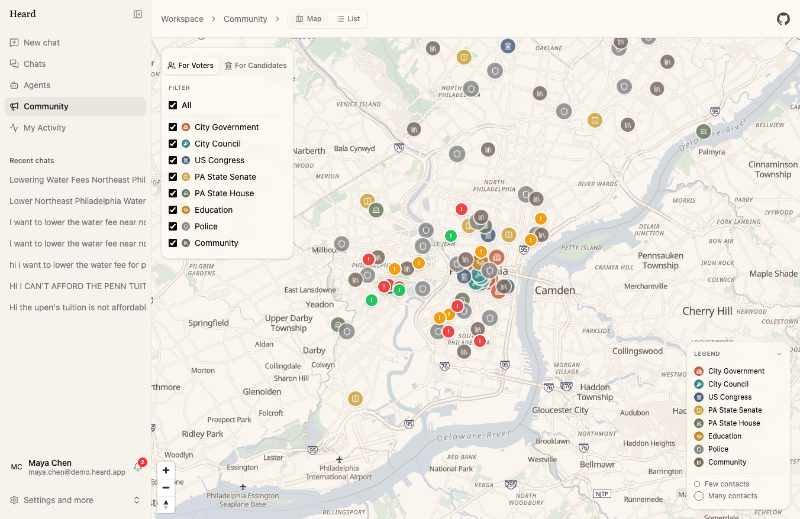
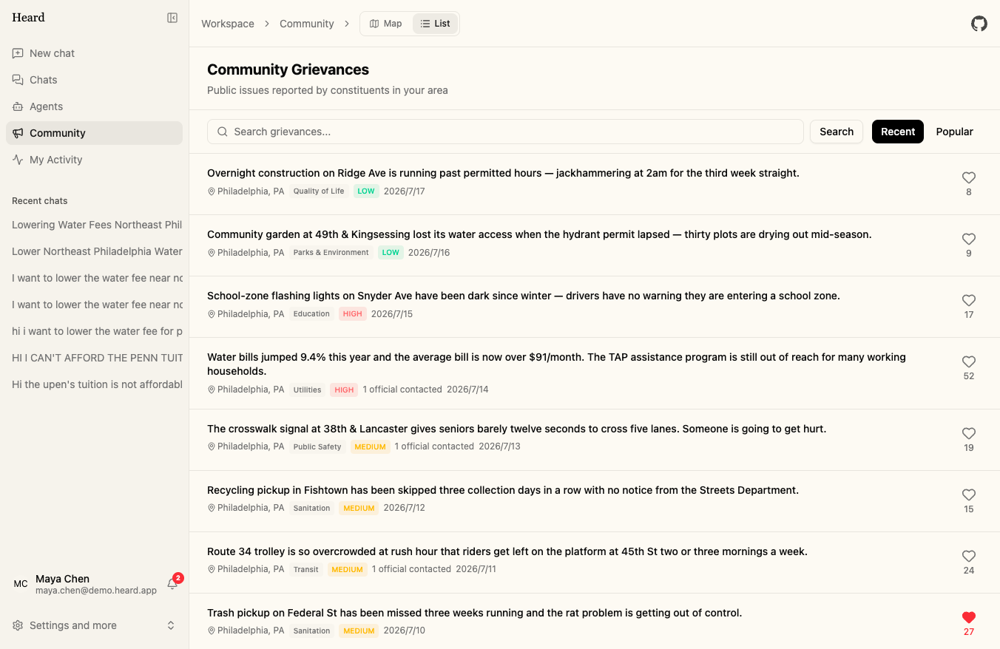
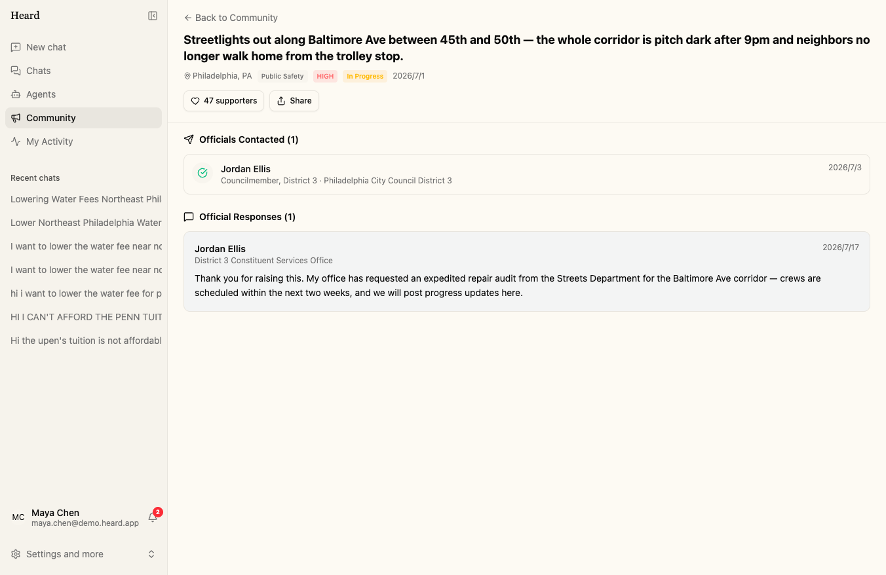
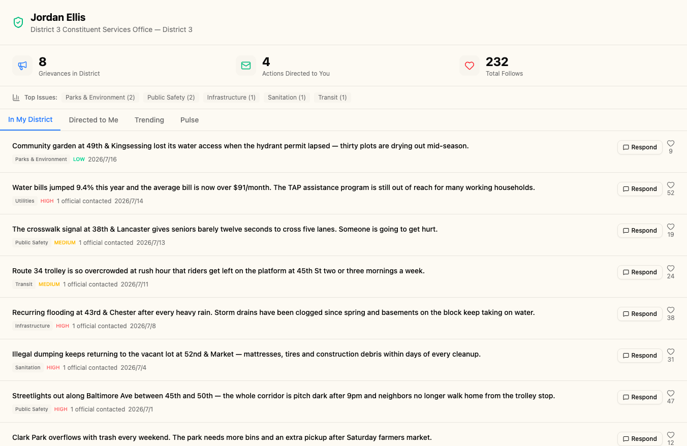
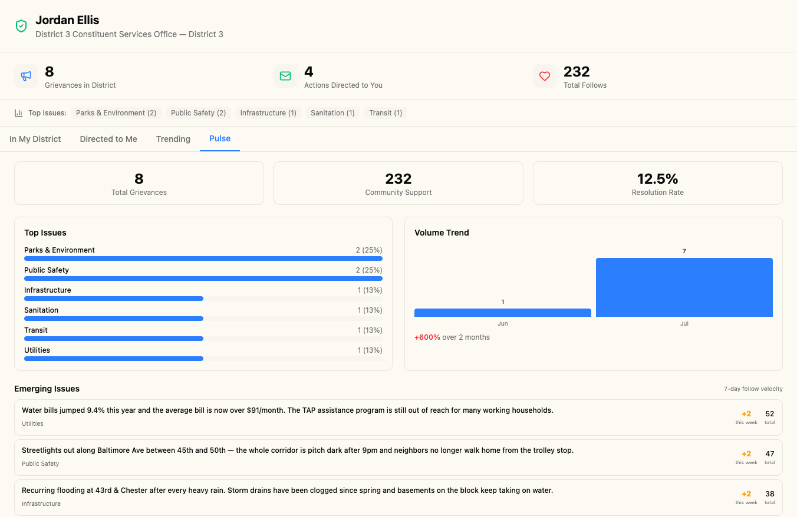
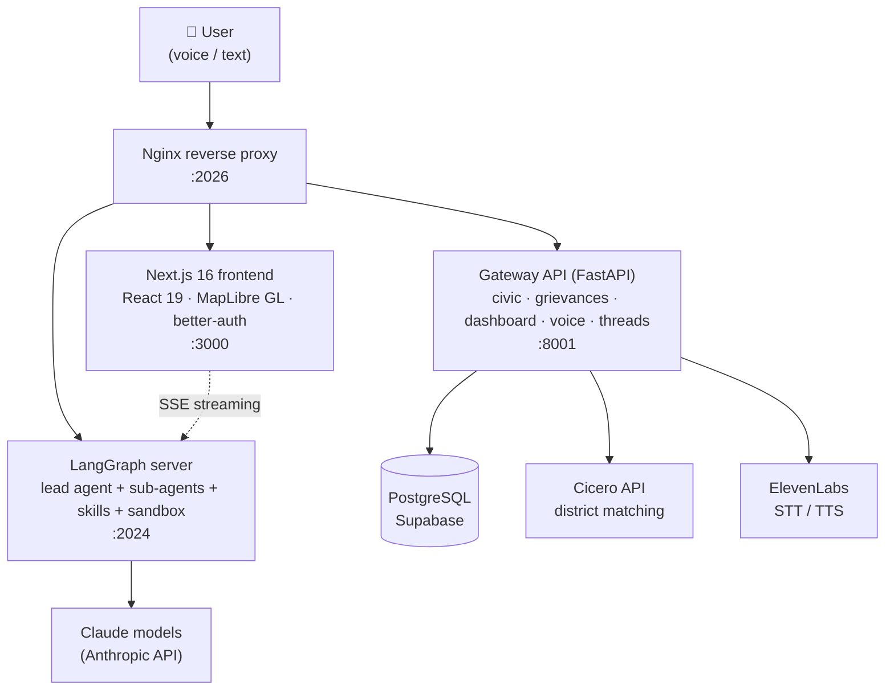

<div align="center">

# Heard

**Turn a personal grievance into political action — in one conversation.**

*Claude × Penn AI Hackathon 2026 · 🥇 First Place, Democratic Governance*

[](./backend/pyproject.toml)
[](./frontend/package.json)
[](./backend/app/gateway)
[](./backend/packages/harness)
[](./backend/migrations)
[](./LICENSE)

[Quick Start](#quick-start) · [Product Tour](#product-tour) · [Features](#features) · [Architecture](#architecture) · [Deployment](#deployment)


</div>

---

## The Problem

Millions of Americans have legitimate grievances with their local, state, and federal government — and no practical way to turn frustration into action. Writing an effective letter to a city council member, figuring out which representative actually owns your issue, or drafting testimony for a public hearing takes expertise most citizens never get the chance to build.

**Heard closes that gap.** You speak (or type) what's wrong in your neighborhood and share your address. Heard's Claude-powered agents research the issue, find every official with jurisdiction — from city council to Congress — and hand you a complete advocacy toolkit: root-cause analysis, drafted letters, a power map, and one-click delivery. Every public grievance also lands on a community map where neighbors, journalists, and verified officials can see what a district actually cares about.

---

## Product Tour

### 1 · Say what's broken

Speak or type your grievance — ElevenLabs speech-to-text handles voice input, and quick-start chips cover the classics (potholes, rent, safety, pollution).

<p align="center">
  
</p>

### 2 · Get an advocacy toolkit, not a chatbot answer

The multi-agent workflow researches the root cause, estimates the affected population, and identifies exactly which officials have jurisdiction. It then emits **inline action cards** — each pre-filled with the right official, a tailored subject line, and a ready-to-send message. One click sends them all and tracks your outreach progress.

<p align="center">
  
</p>

### 3 · Put your issue on the map

Public grievances appear on an interactive civic map of the city — severity-colored dots alongside 95 seeded civic institutions, filterable by level of government. A voter/candidate lens toggle changes what the map highlights.

<p align="center">
  
</p>

### 4 · Rally the neighborhood

The community feed is full-text searchable and sortable by recency or support. Follow an issue to get notified on milestones, status changes, and official responses. Every grievance has a shareable permalink showing which officials were contacted — and what they said back.

<table>
  <tr>
    <td width="50%"></td>
    <td width="50%"></td>
  </tr>
  <tr>
    <td align="center"><em>Searchable, followable grievance feed</em></td>
    <td align="center"><em>Officials-contacted timeline &amp; public responses</em></td>
  </tr>
</table>

### 5 · Close the loop with elected officials

Verified officials get a dashboard of their district: every public grievance in their jurisdiction (matched at the correct level — council district, state house, state senate, or statewide), actions directed at their office, and a **District Pulse** view with category breakdowns, volume trends, and emerging issues. Responding publicly notifies every follower.

<p align="center">
  
</p>

<p align="center">
  
</p>

---

## Features

### Civic Intelligence
- **Multi-agent advocacy workflow** — Claude-powered sub-agents research the issue, identify jurisdiction, and produce a full advocacy package: analysis, letters, testimony, and a strategy brief.
- **Cicero API integration** — one-click geolocation resolves your council, state-house, state-senate, and congressional districts (at-large seats handled).
- **Inline action cards** — structured `action-cards.json` artifacts render as interactive "Send Now" cards inside the chat stream, with per-official rationale and previews.
- **ElevenLabs voice I/O** — speak your grievance (STT) and hear responses aloud (TTS).

### Community & Accountability
- **Civic map** — MapLibre GL map with institution markers, severity-colored grievance dots, category filters, and a heatmap layer.
- **Grievance feed** — PostgreSQL `tsvector` full-text search, sortable by recency or follower count.
- **Shareable grievance pages** — officials-contacted timeline, official responses, and similar-issues suggestions.
- **Follow & notifications** — milestones, status changes, and official replies notify every follower.

### Candidate Experience
- **Verified dashboard** — multi-level district matching surfaces exactly the grievances an official has jurisdiction over.
- **District Pulse analytics** — category breakdown, volume trend, emerging issues by follow velocity, resolution rate.
- **Public responses** — posted answers appear on the grievance page and notify followers.

### Platform
- **Dual-role auth** — better-auth (email + password) with constituent and candidate account types; candidates attach to an institution and get verified.
- **Location privacy** — public display coordinates drift ±0.002° (~200 m) from the true location.
- **Email delivery** — SendGrid integration with graceful console-log fallback for local dev.
- **PostgreSQL persistence** — users, profiles, grievances, follows, sent actions, responses, notifications; migrations auto-run on gateway startup.

---

## Architecture



- **Agent harness** — the runtime under `backend/packages/harness/` (derived from ByteDance's open-source [DeerFlow](https://github.com/bytedance/deer-flow)) orchestrates sub-agents, tools, memory, skills, and a sandbox. All civic product logic, schema, UI, and gateway APIs are Heard's own.
- **Streaming** — the LangGraph SDK streams messages and tool calls to the frontend over SSE; artifacts (letters, briefs, `action-cards.json`) render inline in the chat.
- **District matching** — a candidate's level maps to the right grievance column (`municipal → council_district`, `us_senate → state`, …) so each dashboard shows exactly the issues in that official's jurisdiction.

---

## Quick Start

### Prerequisites

| Tool | Version |
|------|---------|
| Python | 3.12+ |
| Node.js | 22+ |
| [pnpm](https://pnpm.io/) | 10.26+ |
| [uv](https://docs.astral.sh/uv/) | latest |
| nginx | 1.20+ |
| PostgreSQL | 14+ (or a Supabase project) |

```bash
make check   # verify all prerequisites
```

### Install

```bash
git clone https://github.com/StevenWang-CY/Heard.git
cd Heard
make install
```

### Configure

Heard uses a three-file environment system plus two app config files:

```bash
cp .env.example                   .env                    # shared API keys
cp .env.development.example       .env.development        # dev DB + auth secrets
cp .env.production.example        .env.production         # prod DB + auth secrets
cp config.example.yaml            config.yaml             # models, tools, sandbox
cp extensions_config.example.json extensions_config.json  # MCP + skills
```

Fill in at minimum:

```bash
# .env
ANTHROPIC_API_KEY=sk-ant-...   # Claude
CICERO_API_KEY=...             # district matching
ELEVENLABS_API_KEY=...         # voice I/O
TAVILY_API_KEY=...             # optional: web search
JINA_API_KEY=...               # optional: web fetch

# .env.development
DATABASE_URL='postgresql://...'
AUTH_SECRET=$(openssl rand -hex 32)
BETTER_AUTH_SECRET=$AUTH_SECRET
```

Initialize the auth tables on a fresh database (app migrations in `backend/migrations/*.sql` auto-run on gateway startup):

```bash
cd frontend && npx @better-auth/cli migrate -y --config src/server/better-auth/config.ts
```

### Run

```bash
make dev        # all services with hot-reload
# → http://localhost:2026
```

| Command | Purpose |
|---------|---------|
| `make check` | Check system prerequisites |
| `make install` | Install frontend + backend dependencies |
| `make dev` | Start all services in development mode |
| `make start` | Start all services in production mode |
| `make stop` | Stop all services |
| `make doctor` | Diagnose configuration issues |

---

## Tech Stack

| Layer | Technology |
|-------|-----------|
| Agents | LangGraph · LangChain · Claude (Anthropic API) |
| Backend | Python 3.12 · FastAPI · asyncpg · uv |
| Frontend | Next.js 16 · React 19 · TypeScript · Tailwind CSS 4 · shadcn/ui |
| Map | MapLibre GL · OpenFreeMap tiles |
| Auth | better-auth (email + password, PostgreSQL adapter) |
| Data | PostgreSQL (Supabase) · `tsvector` full-text search |
| Voice | ElevenLabs STT + TTS |
| Civic data | Cicero API (districts & officials) |
| Infra | Nginx · Docker · Vercel (frontend) · Render (backend) |

---

## Project Layout

```
Heard/
├── backend/
│   ├── app/gateway/           # FastAPI REST gateway
│   │   ├── routers/           # civic, grievances, dashboard, voice, threads…
│   │   ├── services/          # elevenlabs, sendgrid
│   │   ├── cicero_service.py  # district-matching client
│   │   └── db.py              # asyncpg pool + migration runner
│   ├── packages/harness/      # agent harness (LangGraph orchestration)
│   ├── migrations/            # SQL migrations, auto-run on startup
│   └── pyproject.toml
├── frontend/
│   └── src/
│       ├── app/               # Next.js App Router (landing, workspace, dashboard)
│       ├── components/        # workspace, civic-map, auth, ui
│       ├── core/              # threads, civic, auth, settings
│       └── server/            # better-auth server config
├── skills/                    # agent skills (progressive-load)
├── docker/                    # docker-compose, nginx configs
├── scripts/                   # setup, diagnostics, deployment
├── doc/                       # reference docs + README assets
├── config.example.yaml        # model / tool / sandbox config
├── CLAUDE.md                  # engineering guide for AI pair-programmers
└── README.md                  # you are here
```

---

## Development

### Backend

```bash
cd backend
make dev       # LangGraph server (port 2024)
make gateway   # Gateway API   (port 8001)
make test      # pytest
make lint      # ruff
```

### Frontend

```bash
cd frontend
pnpm dev       # Turbopack dev server (port 3000)
pnpm check     # eslint + tsc --noEmit
pnpm build     # production build
```

### Database migrations

Add new SQL as `backend/migrations/NNN_name.sql`. The gateway applies pending migrations on startup, so production deployments are safe to restart.

---

## Deployment

Heard ships with blueprints for the common free/low-cost path:

- **Frontend → Vercel.** `vercel.json` is pre-configured; point `DEER_FLOW_INTERNAL_GATEWAY_BASE_URL` and `DEER_FLOW_INTERNAL_LANGGRAPH_BASE_URL` at your backend host.
- **Backend → Render.** `render.yaml` + `Dockerfile.render` give a one-click Docker deploy; a single container runs the gateway and LangGraph server under a process supervisor.
- **Database → Supabase** (or any managed Postgres).

Production requires:

- `AUTH_SECRET` / `BETTER_AUTH_SECRET` — cryptographically random, identical on both services.
- `CORS_ALLOWED_ORIGINS` — comma-separated frontend origins.
- `BETTER_AUTH_TRUSTED_ORIGINS` — extra trusted origins (Vercel URLs are picked up automatically from `VERCEL_URL` / `VERCEL_BRANCH_URL` / `VERCEL_PROJECT_PRODUCTION_URL`).

---

## Security

See [SECURITY.md](./SECURITY.md) for the disclosure policy. Highlights:

- `.env*` files are gitignored; only `*.example` templates with placeholders are tracked.
- Public grievance coordinates drift ±0.002° from the true location by design.
- Auth secrets must be regenerated before any deployment.
- The agent sandbox targets a trusted local environment by default — put the gateway behind authentication and network isolation before exposing it publicly.

Found a vulnerability? **Don't open a public issue** — email the maintainer (see SECURITY.md).

---

## Contributing

Contributions are welcome — see [CONTRIBUTING.md](./CONTRIBUTING.md) for the workflow, code style, and PR checklist. All contributors follow the [Code of Conduct](./CODE_OF_CONDUCT.md).

---

## Acknowledgments

- **Claude × Penn AI Hackathon 2026** — winning entry, Democratic Governance track.
- **[Anthropic Claude](https://www.anthropic.com/)** — the reasoning engine behind every agent.
- **[ElevenLabs](https://elevenlabs.io/)** — voice I/O (STT + TTS).
- **[Cicero API](https://www.cicerodata.com/)** — elected-official and political-district data.
- **[DeerFlow](https://github.com/bytedance/deer-flow)** — the open-source super-agent harness by ByteDance that Heard's runtime builds on.
- **[LangChain](https://github.com/langchain-ai/langchain)** / **[LangGraph](https://github.com/langchain-ai/langgraph)** — agent orchestration primitives.
- **[Next.js](https://nextjs.org/)** · **[MapLibre GL](https://maplibre.org/)** · **[OpenFreeMap](https://openfreemap.org/)** · **[better-auth](https://www.better-auth.com/)** · **[shadcn/ui](https://ui.shadcn.com/)**.

> Demo screenshots use seeded example data. Demo accounts and the "Jordan Ellis" officeholder are fictional; institution data reflects public civic directories.

---

## License

[MIT](./LICENSE) © Heard contributors.
